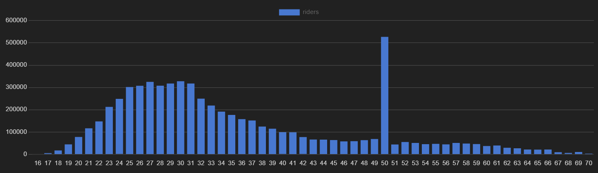
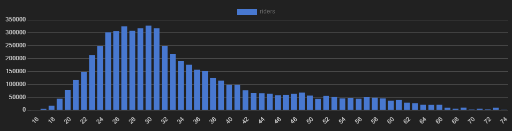

# Conversion Campaign Incentives for Bluebikes rideshare
Analysis of rider data from Bluebikes using PostgreSQL and Tableau. Full presentation is located [here](https://medium.com/@aklesitz/conversion-campaign-incentives-for-bluebikes-242be42e055) on medium.
# Project Overview
The purpose of the Conversion Campaign is to see the popular routes among both short-term customers and subscription based riders in order to find areas where subscriptions could be increased. In order to find
these areas, I have used available demographics data as well as frequently used locations, stations, and routes.
# Data Sources
This data was collected from [Bluebikes System Data](https://bluebikes.com/system-data) and contains records of 6,840,320 rides from 2016-2019. There is a unique numerical id for the bike used, the date and time the ride started and ended, and whether or not the rider purchased a one time use pass (referred to as customer) or holds a subscription (called a subscriber). Demographic information about riders is also included in this dataset, with self-reported columns for birth year and gender.
### Rides Data
Most important to this project was the user_type column, which denotes whether a rider is a one time use customer or a long term subscriber. Subscribers accounted for 80% of riders in this dataset, so the remaining 20% is the demographic I am most concerned about, as I look for potential ways to get these riders to sign up for long term subscriptions.  
Then I looked at the average length of time a rider takes out a bike. First I filtered out rides over 5 hours, as these are likely unreturned or lost bikes, as well as rides under one minute, which are likely user mistakes. Among subscribers, the average length of a ride is 12.61 minutes. Among customers, it is 30.01 minutes.  
The subscription model allows for rides up to 45 minutes in length, so I filtered the data to look at rides no longer than that to find our target demographic of local commuters who do not currently have subscriptions. Tourists are able to buy 24 hour day passes when visiting the city, but are unlikely to sign up for yearly subscriptions.  
This gave me a dataset of 1,090,446 rides in our target demographic to analyze.
[SQL CODE](https://github.com/aklesitz/Bikeshare_Project/blob/main/Bluebikes_rides_data.sql)

### Customer Demographic Data
In analyzing the demographic data, I filtered out riders over 75, as there was a lot of unreliable data in this category. This filtered out 26,033 reported riders, with birth years going back as far as 1863, as well as 447,149 unreported birth years. In total 6.92% of the data on riders' birth years was unreliable. The inverse of that was not a problem. The earliest reported birth year was 2003, and a twenty year old rider seems very likely.    
[SQL CODE](https://github.com/aklesitz/Bikeshare_Project/blob/main/Bluebikes_rider_demographics.sql)    
Visualizing the age distribution of riders revealed another problem:   
  
There is a huge spike among riders aged 54? More likely that riders are reporting their year of birth as 1969. Cute...   
So I took the average amount of riders in that age bracket to smooth out the distribution:   
   
[SQL code](https://github.com/aklesitz/Bikeshare_Project/blob/main/Bluebikes_rider_age_distribution_cleaned.sql)   
Lastly for demographic data, 64% of riders identified as male, 22% female, and around 14% unknown or unreported.   

### Bike Docking Stations
This table contains the latitude and longtitude, district, total number of bike docks, and numerical id for each of the 339 stations across Boston. It is straightforward and needed no cleaning. The latitude and longtitude columns were very helpful in creating visualizations for this project.
### Rides Data
For the data on the rides themselves, I assumed that bikes weren't out for longer than 5 hours. Unreturned or stolen bikes skew the ridership data. This filtered out 16,211 rides across all of the years of data. Perhaps most important to this project was the user_type column, which denotes whether a rider is a one time use customer or a long term subscriber. Subscribers accounted for 80% of riders in this dataset, so the remaining 20% is the demographic I am most concerned about, as I look for potential ways to get these riders to sign up for long term subscriptions.   
The subscription model allows for rides up to 45 minutes in length, so I further filtered the data to look at rides no longer than that to target local commuters who do not currently have subscriptions. Tourists are able to buy 24 hour day passes when visiting the city, but are unlikely to sign up for yearly subscriptions.  
[SQL CODE](https://github.com/aklesitz/Bikeshare_Project/blob/main/Bluebikes_rides_data.sql)
