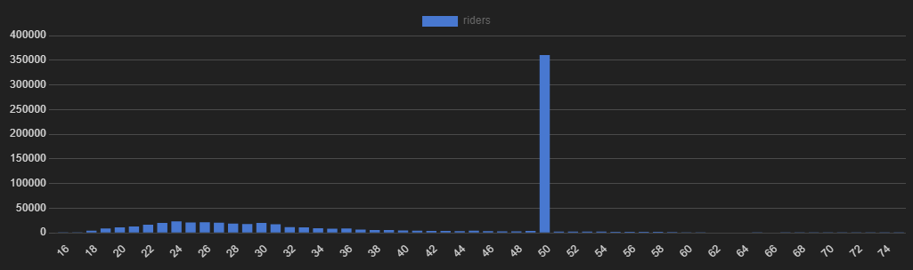

# Conversion Campaign Incentives for Bluebikes rideshare
Analysis of rider data from Bluebikes using PostgreSQL and Tableau. Full presentation is located [here](https://medium.com/@aklesitz/conversion-campaign-incentives-for-bluebikes-242be42e055) on Medium.

# Project Overview
The purpose of this project is to create an interactive map dashboard in Tableau that visualizes the most popular bike routes from each station among both one time use "customers" and subscription-based "subscribers" in order to find areas where subscription rates could be increased. In order to find these areas, I have used available demographics data as well as frequently used locations, stations, and routes sourced from data stored in PostgreSQL databases.

# Project Goals
* Analyze bike share usage patterns
* Visualize most popular routes from each station
* Enable filtering by user type (customers or subscribers), gender, and age group
* Create an interactive map dashboard in Tableau

# Data Sources
## Datasets
* Bluebikes Rides: Contains records of individual bike rides.
  * 4 seperate tables, one for each year 2016-2019
* Bluebikes Stations: Contains information on bike docking stations

## Database Schema
Rides Data
* 'bike_id': unique numerical identifier for each bike
* 'start_time': date and time of ride start
* 'end_time': date and time of ride end
* 'start_station_id': numerical identifier of station bike was rented from
* 'end_station_id': numerical identifier of station bike was returned to
* 'user_type': denotes whether user is customer or subscriber
* 'user_birth_year': user's year of birth (stored as text)
* 'user_gender': integer reflecting user's self-reported gender (0=unknown, 1=male, 2=female)

Stations Data
* 'number': unique alphanumeric identifier for each bike-docking station
* 'name': name of station
* 'latitude'
* 'longitude'
* 'district': neighborhood where station is located
* 'public': denotes if station is available to public (all stations are public, this is useless data)
* 'total_docks': total number of bike docks available at station
* 'id': numerical identifier of bike station (Foreign Key to rides data)

### Rides Data EDA
* Used CTE to combine all four years of data and find:
  * Percentage of Subscribers vs. Customers across total dataset
  * 80% of users are already subscribers  
   
  * Average length of ride for customers and subscribers (in minutes)
    * Here I filtered out rides over 5 hours and under 5 minutes  
   

The subscription model allows for rides up to 45 minutes in length, so I filtered the data to look at rides no longer than that to find our target demographic of local commuters who do not currently have subscriptions. Tourists are able to buy 24 hour day passes when visiting the city, but are unlikely to sign up for yearly subscriptions.  
I want to use this dataset to create an origin-destination map to see the most popular routes taken by riders, so I also joined the latitude and longtitude data for the starting and ending stations from the bluebikes_stations table.
For the user_birth_year column, some were stored as text and some were stored as floating point integers, so I used a CASE statement and a regex expression to search for the entries with a decimal. I then removed the decimal and cast the datatype to numeric. Any nulls were converted to 0's. This will allow me to perform arithmetic later in my analysis and find the ages of users based on their birth year. Bike_id, start_station_id, end_station_id, and user_gender are all unique signifiers and will require no math, but I kept them as integers in order to save space.
This gave me a dataset of 1,045,283 rides in our target demographic to analyze, so I imported the results of this query into a table named 'bluebikes_customers'.  
I applied the same criteria to create a table of commuters who do have subscriptions (for rides between 1 and 45 minutes long) in order to compare the demographics and riding habits of our two datasets, which gave me a dataset of 5,253,200 records.  

[SQL CODE EDA and Data Cleaning](https://github.com/aklesitz/Bikeshare_Project/blob/main/Bluebikes_rides_data.sql)  

Because I don't have superuser access to the source database, I am downloading the results of these queries to csv files in order to migrate them to my own server. No problem with the customer database but the subscriber results are too large to download, so I am splitting the results by year. 

[SQL CODE Cleaned Table Creation](https://github.com/aklesitz/Bikeshare_Project/blob/main/cleaned_table_creation.sql)  

With the data I need properly cleaned and formatted, I can now use it to create an interactive dashboard of the most popular routes originating from each station.  

[SQL CODE Popular Routes Table](https://github.com/aklesitz/Bikeshare_Project/blob/main/bluebikes_routes.sql)  

### Customer And Subscriber Demographic Data Cleaning And EDA
To clean the customer's demographic data, I filtered out riders over 75 as calculated by the last year of data available for this project: 2019. There were reported birth years as far back as 1863, which was obviously unreliable data. This filtered out 9,143 reported rides. I also filtered out the 447,149 unreported birth years. In total 6.67% of the demographics data on riders' birth years was unreliable. The earliest reported birth year was 2003, and a 16 year old rider seemed likely.    
There is a large outlier in the age distribution as seen in this visualization:   
  
There is a huge spike among riders aged 50? More likely that riders are reporting their year of birth as 1969. Cute...   
So I took the average amount of riders in a six year span to smooth out the distribution:   
   
[SQL CODE](https://github.com/aklesitz/Bikeshare_Project/blob/main/bluebikes_customer_demographics.sql)  

The age distribution of the subscription customers had no such problem, although there is a small uptick of users reporting their birth year as 2019:   
  
It is not too surprising that the demographics data for the one time use customers is far less reliable than those who hold a subscription, as people are more hesitant to give their personal data out for a single use ride. Even though the demographics data for customers is largely unreliable, I still want to analyze the routes taken, as demographics data is only a part of my analysis. So I will keep my two datasets as is to load into Tableau. For the demographics visualizations I will need to filter the outliers using Tableau.

### Bike Docking Stations
This table contains the latitude and longtitude, district, total number of bike docks, and numerical id for each of the 339 stations across Boston. It is straightforward and needed no cleaning. The latitude and longtitude columns were very helpful in creating visualizations for this project.

