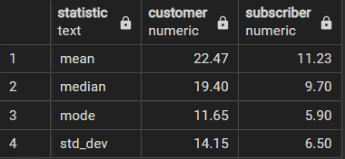
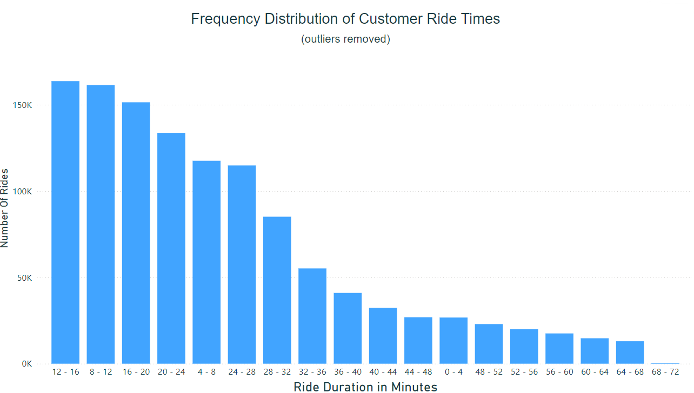

# Conversion Campaign Incentives for Bluebikes rideshare
Analysis of rider data from Bluebikes using PostgreSQL, Tableau, and Power BI. Full presentation is located [here](https://medium.com/@aklesitz/conversion-campaign-incentives-for-bluebikes-242be42e055) on Medium.

# Project Overview
The purpose of this project is to create an interactive map dashboard in Tableau that visualizes the most popular bike routes from each station among both one time use "customers" and subscription-based "subscribers" in order to find areas where subscription rates could be increased. In order to find these areas, I have used available demographics data as well as frequently used locations, stations, and routes sourced from data stored in PostgreSQL databases.

# Project Goals
* Analyze bike share usage patterns
* Visualize most popular routes from each station
* Enable filtering by user type (customers or subscribers), gender, and age group
* Create an interactive map dashboard in Tableau

# Data Sources
## Datasets
* Bluebikes Rides: Contains records of individual bike rides.
  * 4 seperate tables, one for each year 2016-2019
* Bluebikes Stations: Contains information on bike docking stations

## Database Schema
Rides Data
* 'bike_id': unique numerical identifier for each bike
* 'start_time': date and time of ride start
* 'end_time': date and time of ride end
* 'start_station_id': numerical identifier of station bike was rented from
* 'end_station_id': numerical identifier of station bike was returned to
* 'user_type': denotes whether user is customer or subscriber
* 'user_birth_year': user's year of birth (stored as text)
* 'user_gender': integer reflecting user's self-reported gender (0=unknown, 1=male, 2=female)
* 'ride_id': I added a primary key for each ride across all four years of data using a global sequence
  * I did this so that I can find and remove the outliers and errors based off ride duration and then add the demographic data back in after
  * [SQL ADD PRIMARY KEY](https://github.com/aklesitz/Bikeshare_Project/blob/main/add_primary_key.sql)  

Stations Data
* 'number': unique alphanumeric identifier for each bike-docking station
* 'name': name of station
* 'latitude'
* 'longitude'
* 'district': neighborhood where station is located
* 'public': denotes if station is available to public (all stations are public, this is useless data)
* 'total_docks': total number of bike docks available at station
* 'id': numerical identifier of bike station (Foreign Key to rides data)

## Rides Data EDA
* Used CTE to combine all four years of data and find:
  * Percentage of Subscribers vs. Customers across total dataset
  * 80% of users are already subscribers
  * The 19% of users who are not signed up for a subscription plan is our target demographic  
[SQL CODE USER TYPE MAKEUP](https://github.com/aklesitz/Bikeshare_Project/blob/main/cust_type_percentage.sql)  

* Average ride duration for customers and subscribers (in minutes)
  * Created temporary tables containing just ride durations for both customers and subscribers
  * Identified quartiles to find and exclude outliers 
  * Created new tables with identified outliers removed   
  [SQL CODE OUTLIER IDENTIFICATION AND AVG RIDE TIME](https://github.com/aklesitz/Bikeshare_Project/blob/main/sub_cust_avg_duration.sql)   
     
* Uploaded cleaned data to Power BI to create visualizations
  * **Frequency distribution for subscriber ride times:**   
     
  * **Frequency distribution for customer ride times:**   
     

